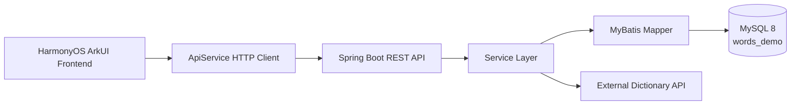

<div align="center">
  <p>
    
  </p>

**English** | [简体中文](README_zh-CN.md) | [日本語](README_ja.md)

<br>

<div>
    <a href="https://github.com/lechan775/ChenDuPlan/actions"></a>
    <a href="https://github.com/lechan775/ChenDuPlan/blob/main/LICENSE"></a>
    <a href="https://github.com/lechan775/ChenDuPlan/releases"></a>
    <br>
    
    
    
    
    
</div>
</div>
<br>

**ChenDu Plan (晨读计划)** is a full-stack vocabulary learning mobile application built on **HarmonyOS ArkUI + Spring Boot**. It features a clean ArkTS declarative UI for an engaging word practice experience, backed by a Spring Boot + MyBatis + MySQL RESTful API with full data persistence.

<div align="center">
  
</div>

---

## 📖 Overview

ChenDu Plan is a vocabulary builder designed for Chinese college students preparing for **CET-4, CET-6, and postgraduate entrance exams (考研)**. The core interaction is a **4-option multiple-choice quiz**, with support for:

- 🎯 **Smart Questioning**: Sequential word delivery with learn & review modes
- 📊 **Progress Tracking**: Daily study records, streak calendar, accuracy stats
- 📝 **Mistake Review**: Auto-logged wrong answers with sentence context & reason analysis
- 📌 **Word Bookmarks**: One-tap save to notebook with custom notes & review reminders
- 🏆 **Book Progress**: Per-book tracking of learned / to-review / completion percentage
- 🔐 **User System**: Registration, login, profile management, default book switching

---

## 🏗 Architecture



| Layer | Stack |
|---|---|
| Frontend | HarmonyOS ArkTS + ArkUI + @kit.NetworkKit |
| Backend | Spring Boot 4.0.5 + Java 17 + MyBatis 4.0.1 |
| Database | MySQL 8.0 + utf8mb4_unicode_ci |
| API Protocol | RESTful JSON (unified `{code, message, data}` envelope) |

---

## ✨ Features

<details open>
<summary><b>🔤 Core Quiz</b></summary>

- **3 Word Books**: CET-4 / CET-6 / Postgraduate, 300 words each (900 total)
- **4-Option Quiz**: Word + phonetic + definition display, tap to answer
- **Instant Feedback**: Correct/incorrect highlighting, answer reveal, memory tips & examples
- **Dual Mode**: Learn mode (sequential) + Review mode (revisit learned words)
- **Word Details**: Expandable memory tip, English example, Chinese translation
</details>

<details open>
<summary><b>📊 Learning Analytics</b></summary>

- **Real-time Stats**: Total words learned, streak days, overall accuracy rate
- **Calendar View**: Monthly calendar with orange dots on study days, blue border for today
- **Study Log**: Daily breakdown (new words / reviewed / accuracy / duration)
</details>

<details open>
<summary><b>📝 Mistake & Notebook Management</b></summary>

- **Wrong Word Book**: Auto-logged mistakes with error count, wrong sentence, reason
- **Word Notebook**: Manual bookmarking with notes, mastery labels, next-review dates
- **Delete Protection**: Confirmation dialog before removal
</details>

<details open>
<summary><b>👤 User System</b></summary>

- **Register/Login**: SHA-256 password hashing, local state persistence after login
- **Profile**: Editable nickname, daily goal, signature, default book
- **Book Switching**: Switch current book anytime, progress tracked independently
</details>

---

## 🚀 Quick Start

### Prerequisites

- **DevEco Studio** (HarmonyOS SDK) — for frontend compilation
- **JDK 17+** — for backend compilation
- **MySQL 8.0+** — database
- **Maven 3.6+** — backend dependency management

<details open>
<summary><b>1. Database Setup</b></summary>

Run the initialization script in MySQL:

```bash
mysql -u root -p < demo_backend/src/main/resources/db/init_words_demo.sql
```

This will:
- Create the `words_demo` database (utf8mb4_unicode_ci)
- Create all 8 business tables
- Seed 3 word books, 30 sample words, and 1 test user
</details>

<details open>
<summary><b>2. Backend Configuration &amp; Launch</b></summary>

**Configure database connection** (choose one):

Option A: Copy environment template (recommended)
```bash
cp .env.example .env
# Edit .env with your database credentials
```

Option B: Set system environment variables
```bash
# Linux / macOS
export DB_URL="jdbc:mysql://localhost:3306/words_demo?useUnicode=true&characterEncoding=utf8&serverTimezone=Asia/Shanghai"
export DB_USERNAME="root"
export DB_PASSWORD="your_password"
```

Option C: Edit application.properties directly
```bash
cp demo_backend/src/main/resources/application.properties.example demo_backend/src/main/resources/application.properties
# Replace ${...} placeholders with real values
```

**Build &amp; run**:
```bash
cd demo_backend
mvn spring-boot:run
```

Default port: `http://localhost:8080` — Health check: `GET /api/ping`
</details>

<details open>
<summary><b>3. Frontend Launch</b></summary>

1. Open `demo/` in DevEco Studio
2. Update `API_BASE_URL` in `entry/src/main/ets/api/ApiConfig.ets` to your backend address
3. Run on emulator or device

Test account: `demo_user` / `123456`
</details>

---

## 📡 API Reference

| Method | Endpoint | Description |
|---|---|---|
| `POST` | `/api/auth/register` | Register |
| `POST` | `/api/auth/login` | Login |
| `GET` | `/api/user/profile?userId=` | Get profile |
| `PUT` | `/api/user/profile` | Update profile |
| `GET` | `/api/books` | List word books |
| `GET` | `/api/books/progress?userId=` | Book learning progress |
| `GET` | `/api/words?bookId=` | List words |
| `GET` | `/api/words/next?userId=&bookId=&mode=` | Get next word |
| `GET` | `/api/words/search?keyword=` | Search words |
| `POST` | `/api/words/import` | Import words |
| `POST` | `/api/study/submit` | Submit quiz answer |
| `GET` | `/api/study-records?userId=` | Study records |
| `GET` | `/api/stats/overview?userId=` | Learning stats |
| `GET` | `/api/notebook-words?userId=` | Notebook list |
| `POST` | `/api/notebook-words` | Add to notebook |
| `DELETE` | `/api/notebook-words/{id}?userId=` | Remove from notebook |
| `GET` | `/api/wrong-words?userId=` | Wrong words list |
| `DELETE` | `/api/wrong-words/{id}?userId=` | Remove wrong word |
| `GET` | `/api/sign/status?userId=` | Sign-in status |
| `POST` | `/api/sign` | Daily sign-in |
| `GET` | `/api/ping` | Health check |

**Unified Response Format**:

```json
{
  "code": 200,
  "message": "OK",
  "data": { ... }
}
```

---

## 🗄 Database Schema

8 business tables:

| Table | Purpose | Foreign Keys |
|---|---|---|
| `users` | User accounts | — |
| `books` | Word book metadata | — |
| `user_books` | User-book progress (M2M) | `user_id`, `book_id` |
| `words` | Word bank | `book_id` |
| `notebook_words` | User word notebook | `user_id` |
| `wrong_words` | Wrong word log | `user_id` |
| `study_records` | Daily study log | `user_id` |
| `sign_records` | Sign-in log | `user_id` |

See [er_diagram_ppt.png](er_diagram_ppt.png) for the full ER diagram.

---

## 📁 Project Structure

```
demo/                          # Frontend (HarmonyOS ArkUI)
├── entry/src/main/ets/
│   ├── api/
│   │   ├── ApiConfig.ets      # Backend URL config
│   │   └── ApiService.ets     # HTTP client (GET/POST/PUT/DELETE)
│   ├── data/
│   │   ├── AppState.ets       # Global state (user profile/books/words)
│   │   └── CurrentUser.ets    # Current user persistence
│   ├── pages/
│   │   ├── LoginPage.ets      # Login screen
│   │   ├── RegisterPage.ets   # Registration screen
│   │   ├── MainPage.ets       # Home (3 tabs + embedded quiz page)
│   │   ├── CollectionPage.ets # Word notebook
│   │   ├── WrongBookPage.ets  # Wrong word book
│   │   ├── StudyRecordPage.ets# Study history (w/ calendar view)
│   │   └── ProfilePage.ets    # Profile editor
│   └── utils/
│       └── UiFeedback.ets     # Toast / navigation utilities

demo_backend/                  # Backend (Spring Boot)
├── src/main/java/org/example/demo_backend/
│   ├── controller/            # 11 REST Controllers
│   ├── service/               # Business logic layer
│   ├── mapper/                # MyBatis data access layer
│   ├── entity/                # Entity classes
│   └── dto/                   # Data Transfer Objects
└── src/main/resources/
    ├── application.properties # Database & server config
    └── db/
        └── init_words_demo.sql# Database init script
```

---

## 🎨 UI Pages

| Page | Key Components |
|---|---|
| **LoginPage** | Logo, account/password inputs, login button, register link |
| **RegisterPage** | Back nav, account/nickname/password/confirm, register button |
| **MainPage** | Bottom 3-tab bar (Quiz/Books/Profile), embedded quiz page |
| **StudyPracticePage** | Word card, 4 options, add-notebook/quit/submit buttons |
| **BookTab** | Swiper carousel, book cards, progress bars, set-current button |
| **MineTab** | Avatar, 4 entry points (Notebook/WrongBook/Records/Profile) |
| **CollectionPage** | Notebook word list, mastery tags, notes, delete |
| **WrongBookPage** | Wrong word list, error count, wrong sentence, reason, delete |
| **StudyRecordPage** | Stats summary, monthly calendar view, study log |
| **ProfilePage** | Nickname/goal/signature/book edit form |

Full UI architecture: [frontend_architecture.html](frontend_architecture.html)

---

## 🔒 Security

- Passwords hashed with **SHA-256** (no plaintext storage)
- All API endpoints use `userId` for data isolation
- Frontend HTTP client has unified timeout control (connect/read 15s)
- Production deployment should add HTTPS and token-based authentication

---

## 📄 License

This project is open-sourced under the [MIT License](LICENSE).

---

## 🤝 Contributing

Issues and Pull Requests are welcome. Please read [CONTRIBUTING.md](CONTRIBUTING.md) before contributing.

---

## 👤 Author

**Guowei Jiang (lechan775)**

- GitHub: [@lechan775](https://github.com/lechan775)
- Email: untapped-word-fit@duck.com

---

<div align="center">
  <p>Made with ❤️ by lechan775</p>
  <p>
    <a href="https://github.com/lechan775"></a>
    <a href="https://github.com/lechan775/ChenDuPlan/stargazers"></a>
  </p>
</div>
