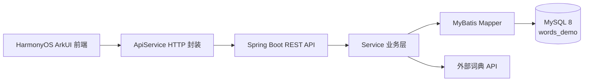

<div align="center">
  <p>
    
  </p>

[English](README.md) | **简体中文** | [日本語](README_ja.md)

<br>

<div>
    <a href="https://github.com/lechan775/ChenDuPlan/actions"></a>
    <a href="https://github.com/lechan775/ChenDuPlan/blob/main/LICENSE"></a>
    <a href="https://github.com/lechan775/ChenDuPlan/releases"></a>
    <br>
    
    
    
    
    
</div>
</div>
<br>

**晨读计划 (ChenDu Plan)** 是一款基于 HarmonyOS ArkUI + Spring Boot 的全栈背单词移动应用。前后端分离架构，前端采用 ArkTS 声明式 UI 构建流畅的背词交互体验，后端基于 Spring Boot + MyBatis + MySQL 提供稳定的 RESTful API 和持久化支持。

<div align="center">
  
</div>

---

## 📖 简介

晨读计划是一款面向大学生和考研党的背单词工具，覆盖**四级 (CET-4)、六级 (CET-6) 和考研英语**三本核心词书。核心交互采用**四选一选择题**模式，支持：

- 🎯 **智能出题**：自动按词书顺序出题，支持新学与复习双模式
- 📊 **学习追踪**：每日学习记录、连续打卡日历、正确率统计
- 📝 **错词复盘**：答错自动入库，含错误句子与原因分析
- 📌 **生词收藏**：一键加入生词本，支持自定义笔记与复习提醒
- 🏆 **词书进度**：每本书独立追踪已学/待复习/进度百分比
- 🔐 **用户系统**：注册、登录、个人资料管理、默认词书切换

---

## 🏗 架构



| 层 | 技术栈 |
|---|---|
| 前端 | HarmonyOS ArkTS + ArkUI + @kit.NetworkKit |
| 后端 | Spring Boot 4.0.5 + Java 17 + MyBatis 4.0.1 |
| 数据库 | MySQL 8.0 + utf8mb4_unicode_ci |
| API 协议 | RESTful JSON (统一 `{code, message, data}` 格式) |

---

## ✨ 特性

<details open>
<summary><b>🔤 背词核心</b></summary>

- **三本词书**：四级高频词汇 / 六级高频词汇 / 考研核心词汇，每本 300 词，总计 900 词
- **四选一答题**：单词 + 音标 + 释义展示，四个选项点击作答
- **即时反馈**：选对/选错高亮、正确答案标注、记忆技巧与例句展示
- **双模式切换**：新学模式（按序出题）+ 复习模式（回顾已学单词）
- **单词详情**：点击展开记忆技巧、英文例句、中文翻译
</details>

<details open>
<summary><b>📊 学习追踪</b></summary>

- **实时统计**：累计学习词数、连续打卡天数、总体正确率
- **日历打卡**：月视图日历，学习日以橙色圆点标记，今日蓝色描边高亮
- **学习记录**：每日学习流水（新学/复习数量、正确率、学习时长）
</details>

<details open>
<summary><b>📝 错词与生词管理</b></summary>

- **错题本**：答错自动入库，记录错误次数、答错句子、错误原因
- **生词本**：手动收藏，支持自定义笔记、掌握度标签、下次复习日期
- **删除保护**：删除操作需弹窗二次确认
</details>

<details open>
<summary><b>👤 用户系统</b></summary>

- **注册/登录**：SHA-256 密码哈希，登录后本地持久化用户状态
- **个人资料**：昵称、每日目标、学习签名、默认词书可编辑
- **词书切换**：随时切换当前学习词书，进度独立保存
</details>

---

## 🚀 快速开始

### 环境要求

- **DevEco Studio** (HarmonyOS SDK) — 前端编译运行
- **JDK 17+** — 后端编译运行
- **MySQL 8.0+** — 数据库
- **Maven 3.6+** — 后端依赖管理

<details open>
<summary><b>1. 数据库初始化</b></summary>

在 MySQL 中执行初始化脚本：

```bash
mysql -u root -p < demo_backend/src/main/resources/db/init_words_demo.sql
```

该脚本会自动：
- 创建 `words_demo` 数据库（utf8mb4_unicode_ci）
- 创建 8 张业务表
- 插入 3 本词书、30 个示例单词、1 个测试用户
</details>

<details open>
<summary><b>2. 后端配置与启动</b></summary>

**配置数据库连接**（三选一）：

方式 A：复制环境变量模板（推荐）
```bash
cp .env.example .env
# 编辑 .env 文件，填入你的数据库密码
```

方式 B：设置系统环境变量
```bash
# Windows PowerShell
$env:DB_URL="jdbc:mysql://localhost:3306/words_demo?useUnicode=true&characterEncoding=utf8&serverTimezone=Asia/Shanghai"
$env:DB_USERNAME="root"
$env:DB_PASSWORD="your_password"
```

方式 C：直接编辑 `application.properties`
```bash
cp demo_backend/src/main/resources/application.properties.example demo_backend/src/main/resources/application.properties
# 编辑 application.properties，替换 ${...} 占位符为真实值
```

**编译并启动**：
```bash
cd demo_backend
mvn spring-boot:run
```

默认监听 `http://localhost:8080`，健康检查：`GET /api/ping`
</details>

<details open>
<summary><b>3. 前端运行</b></summary>

1. 用 DevEco Studio 打开 `demo/` 目录
2. 修改 `entry/src/main/ets/api/ApiConfig.ets` 中的 `API_BASE_URL` 为后端地址
3. 启动模拟器或连接真机运行

默认测试账号：`demo_user` / `123456`
</details>

---

## 📡 API

| 方法 | 端点 | 说明 |
|---|---|---|
| `POST` | `/api/auth/register` | 用户注册 |
| `POST` | `/api/auth/login` | 用户登录 |
| `GET` | `/api/user/profile?userId=` | 获取个人信息 |
| `PUT` | `/api/user/profile` | 修改个人信息 |
| `GET` | `/api/books` | 词书列表 |
| `GET` | `/api/books/progress?userId=` | 词书学习进度 |
| `GET` | `/api/words?bookId=` | 单词列表 |
| `GET` | `/api/words/next?userId=&bookId=&mode=` | 获取下一个单词 |
| `GET` | `/api/words/search?keyword=` | 搜索单词 |
| `POST` | `/api/words/import` | 导入单词 |
| `POST` | `/api/study/submit` | 提交答题结果 |
| `GET` | `/api/study-records?userId=` | 学习记录 |
| `GET` | `/api/stats/overview?userId=` | 学习统计 |
| `GET` | `/api/notebook-words?userId=` | 生词本列表 |
| `POST` | `/api/notebook-words` | 添加生词 |
| `DELETE` | `/api/notebook-words/{id}?userId=` | 删除生词 |
| `GET` | `/api/wrong-words?userId=` | 错题本列表 |
| `DELETE` | `/api/wrong-words/{id}?userId=` | 删除错词 |
| `GET` | `/api/sign/status?userId=` | 签到状态 |
| `POST` | `/api/sign` | 每日签到 |
| `GET` | `/api/ping` | 健康检查 |

**统一响应格式**：

```json
{
  "code": 200,
  "message": "成功",
  "data": { ... }
}
```

---

## 🗄 数据库

8 张业务表：

| 表 | 说明 | 关键外键 |
|---|---|---|
| `users` | 用户账户 | — |
| `books` | 词书元数据 | — |
| `user_books` | 用户-词书学习进度（多对多） | `user_id`, `book_id` |
| `words` | 单词库 | `book_id` |
| `notebook_words` | 生词本 | `user_id` |
| `wrong_words` | 错词本 | `user_id` |
| `study_records` | 每日学习记录 | `user_id` |
| `sign_records` | 签到记录 | `user_id` |

ER 图详见：[er_diagram_ppt.png](er_diagram_ppt.png)

---

## 📁 项目结构

```
demo/                          # 前端 (HarmonyOS ArkUI)
├── entry/src/main/ets/
│   ├── api/
│   │   ├── ApiConfig.ets      # 后端地址配置
│   │   └── ApiService.ets     # HTTP 请求封装 (GET/POST/PUT/DELETE)
│   ├── data/
│   │   ├── AppState.ets       # 全局状态 (用户资料/词书/单词)
│   │   └── CurrentUser.ets    # 当前登录用户持久化
│   ├── pages/
│   │   ├── LoginPage.ets      # 登录页
│   │   ├── RegisterPage.ets   # 注册页
│   │   ├── MainPage.ets       # 主页 (3 Tab + 练习页内嵌)
│   │   ├── CollectionPage.ets # 生词本
│   │   ├── WrongBookPage.ets  # 错题本
│   │   ├── StudyRecordPage.ets# 学习记录 (含日历打卡)
│   │   └── ProfilePage.ets    # 个人资料编辑
│   └── utils/
│       └── UiFeedback.ets     # Toast / 路由工具

demo_backend/                  # 后端 (Spring Boot)
├── src/main/java/org/example/demo_backend/
│   ├── controller/            # 11 个 REST Controller
│   │   ├── AuthController.java
│   │   ├── UserController.java
│   │   ├── BookController.java
│   │   ├── WordController.java
│   │   ├── StudyController.java
│   │   ├── StudyRecordController.java
│   │   ├── StatsController.java
│   │   ├── NotebookWordController.java
│   │   ├── WrongWordController.java
│   │   ├── SignController.java
│   │   └── PingController.java
│   ├── service/               # 业务逻辑层
│   ├── mapper/                # MyBatis 数据访问层
│   ├── entity/                # 实体类 (User, Book, Word 等)
│   └── dto/                   # 数据传输对象
└── src/main/resources/
    ├── application.properties # 数据库/服务器配置
    └── db/
        └── init_words_demo.sql# 数据库初始化脚本
```

---

## 🎨 前端页面

| 页面 | 核心组件 |
|---|---|
| **LoginPage** | Logo、账号密码输入、登录按钮、注册入口 |
| **RegisterPage** | 返回导航、账号/昵称/密码/确认密码、注册按钮 |
| **MainPage** | 底部 3 Tab (背词/词书/我的)，动态切换练习页 |
| **StudyPracticePage** | 单词卡片、4 选 1 选项、加入生词本/退出/提交 |
| **BookTab** | Swiper 励志轮播、词书卡片、进度条、设置当前 |
| **MineTab** | 头像、生词本/错题本/学习记录/个人资料入口 |
| **CollectionPage** | 生词列表、掌握度标签、笔记、删除 |
| **WrongBookPage** | 错词列表、错误次数、答错句子、原因、删除 |
| **StudyRecordPage** | 统计摘要、月日历打卡视图、学习流水 |
| **ProfilePage** | 昵称/每日目标/签名/默认词书编辑表单 |

全页面架构图详见：[frontend_architecture.html](frontend_architecture.html)

---

## 🔒 安全

- 密码使用 **SHA-256** 哈希存储，不保存明文
- 所有 API 参数使用 `userId` 进行数据隔离
- 前端网络请求统一超时控制（连接/读取 15s）
- 建议生产环境启用 HTTPS 并加入 Token 认证机制

---

## 📄 许可证

本项目基于 [MIT License](LICENSE) 开源。

---

## 🤝 贡献

欢迎提交 Issue 和 Pull Request。贡献前请阅读 [CONTRIBUTING.md](CONTRIBUTING.md)。

---

## 👤 作者

**Guowei Jiang (lechan775)**

- GitHub: [@lechan775](https://github.com/lechan775)
- 邮箱: untapped-word-fit@duck.com

---

<div align="center">
  <p>Made with ❤️ by lechan775</p>
  <p>
    <a href="https://github.com/lechan775"></a>
    <a href="https://github.com/lechan775/ChenDuPlan/stargazers"></a>
  </p>
</div>
